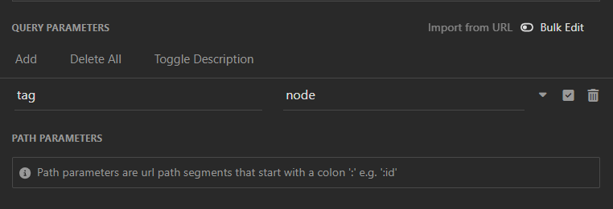

## VUTTR BACKEND CHALLENGE

O objetivo do desafio era construir uma API e um banco de dados para a aplicação VUTTR (Very Useful Tools to Remember), um repositório para gerenciar ferramentas com seus nomes, links, descrições e tags.

### TECNOLOGIAS UTILIZADAS

- Node.js
- Express.js
- Postgres
- typescript
- Prisma

### INSTALAÇÃO

1. Clone o repositório
   ```bash
   git clone https://github.com/PatrickAraujoD/VUTTR-BACKEND-CHALLENGE
2. Instale as dependências 
   
   ````bash
   cd nome-projeto
   npm install
3. Crie um banco e pegue e monte a url
   
   url = `"postgresql://<user>:<password>@localhost:<port>/<dbname>?schema=public"`

4. Configure a url do banco de dados nas variáveis de ambiente
   
   crie um arquivo `.env` na raiz do projeto e defina o nome da variável `DATABASE_URL` e atribua a url do banco 

5. Inicie o servidor 

    ```bash
    npm run dev
### Endpoints da API

A API expõe os seguintes endpoints:

- `POST /tools`: incluir uma nova ferramenta

    ### Exemplo do corpo da requisição
  
    ```json
        {
            "title": "Notion",
            "link": "https://notion.so",
            "description": "All in one tool to organize teams and ideas. Write, plan, collaborate, and get organized. ",
            "tags": [
                "organization",
                "planning",
                "collaboration",
                "writing",
                "calendar"
            ]
        }
- `GET /tools`: lista todas as ferramentas
    ```json
     {
        "id": 1,
        "title": "Notion",
        "link": "https://notion.so",
        "description": "All in one tool to organize teams and ideas. Write, plan, collaborate, and get organized. ",
        "tags": [
            "organization",
            "planning",
            "collaboration",
            "writing",
            "calendar"
        ]
    }
- `GET /tools/tag`

    Lista todas as ferramentas relacionadas a uma tag específica.

    #### Parâmetros de Consulta

    - `tag` (string): A tag pela qual você deseja filtrar as ferramentas.

    ***Exemplo de Requisição***

    

    Isso trará todas as ferramentas relacionadas à tag "node".

    #### Resposta de Sucesso

    - **Código:** 200 OK
    - **Conteúdo:** 
    
    ```json
        [
            {
                "id": 2,
                "title": "json-server",
                "link": "https://github.com/typicode/json-server",
                "description": "Fake REST API based on a json schema. Useful for mocking and creating APIs for front-end devs to consume in coding challenges.",
                "tags": [
                    "api",
                    "json",
                    "schema",
                    "node",
                    "github",
                    "rest"
                ]
            },
            {
                "id": 3,
                "title": "fastify",
                "link": "https://www.fastify.io/",
                "description": "Extremely fast and simple, low-overhead web framework for NodeJS. Supports HTTP2.",
                "tags": [
                    "web",
                    "framework",
                    "node",
                    "http2",
                    "https",
                    "localhost"
                ]
            }
        ]   
- `DELETE /tools/id`
  
  substitua o nome `id` pelo id original da mensagem que deseja deletar.

  - ***Código***: 200 OK
  - ***Conteúdo***: 
  ```json
  {}
### Licença 

Este projeto está licenciado sob a [Licença MIT](https://mit-license.org/)

## Contato
Se tiver alguma dúvida, sugestão ou precisar de suporte, sinta-se à vontade para entrar em contato com os criadores do projeto:

- **Patrick Camara Araujo**

    - **Email**: [patrickaraujo2067@gmail.com](patrickaraujo2067@gmail.com)
  
    - **GitHub**: [PatrickAraujoD](https://github.com/PatrickAraujoD)
- **Desafio no Notion**: [Aplicação VUTTR (Very Useful Tools to Remember)](https://bossabox.notion.site/Back-end-0b2c45f1a00e4a849eefe3b1d57f23c6)

